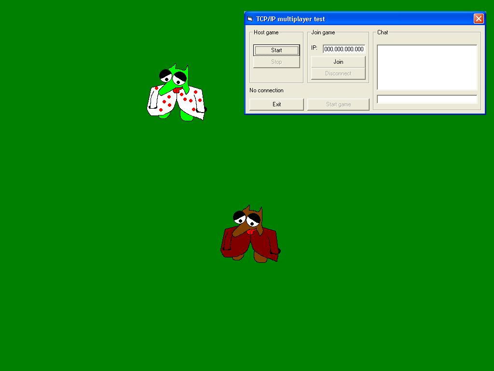



## IP multiplayer test

### Description

This is my first submission, a multiplayer game. In fact it's not really a game, because there isn't any quest or weapons or whatever, you can only see the other player walk around. The game doesn't use any directX, it's just moving pictureboxes. I think it's great for people who want to learn how to use winsock to make multiplayer games. And... what do you think about the cool animal (knoerf). Please give me some feedback. It's my first submission and I would really like to hear if I'm doing anything wrong... Thanks
 
### More Info
 

             |
---                |---
**Submitted On**   |2003-08-07 12:49:22
**By**             |[Ratarf](https://github.com/Planet-Source-Code/PSCIndex/blob/master/ByAuthor/ratarf.md)
**Level**          |Beginner
**User Rating**    |5.0 (10 globes from 2 users)
**Compatibility**  |VB 6\.0
**Category**       |[Internet/ HTML](https://github.com/Planet-Source-Code/PSCIndex/blob/master/ByCategory/internet-html__1-34.md)
**World**          |[Visual Basic](https://github.com/Planet-Source-Code/PSCIndex/blob/master/ByWorld/visual-basic.md)
**Archive File**   |[IP\_multipl162676892003\.zip](https://github.com/Planet-Source-Code/ratarf-ip-multiplayer-test__1-47485/archive/master.zip)

